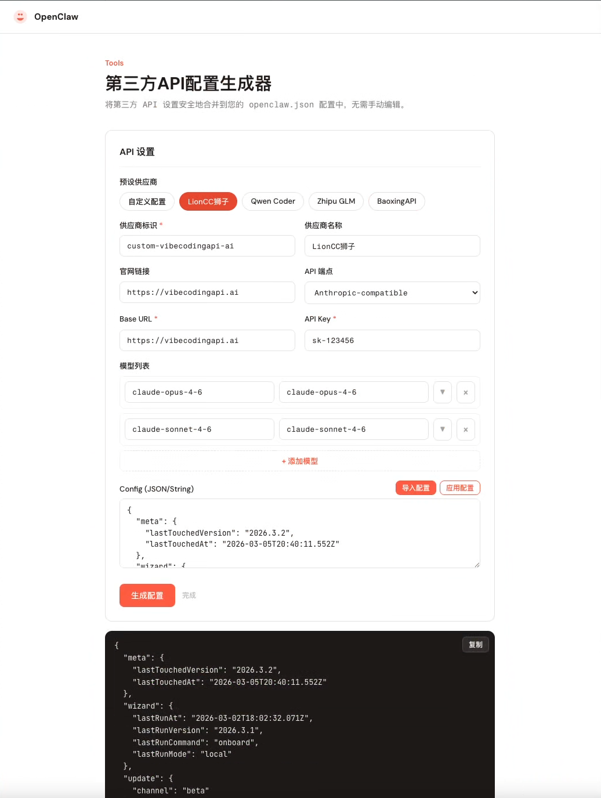

# OpenClaw Config Generator

### OpenClaw 第三方 API 供应商配置插件

[](https://www.npmjs.com/package/openclaw-config-generator)
[](https://github.com/BaoxingZhang/openclaw-config-generator/blob/main/LICENSE)
[](https://docs.openclaw.ai/tools/plugin)

---

## 为什么需要这个插件？

OpenClaw 支持数十个模型供应商，但配置它们意味着手动编辑 `~/.openclaw/openclaw.json` — 处理嵌套 JSON、记住各种端点 URL，还要确保不破坏现有设置。

**OpenClaw Config Generator** 提供可视化 Web UI，让你轻松配置第三方 API 供应商。选择预设或填写自定义信息，插件会安全地将配置合并到你的配置文件中 — 自动备份，无需手动编辑 JSON。

- **一键预设** — 内置供应商模板，预填端点、模型和设置
- **安全合并** — 仅更新 `models` 和 `agents` 部分，所有其他设置完整保留
- **自动备份** — 每次写入前自动创建带时间戳的备份
- **动态模型列表** — 每个供应商可添加多个模型，支持高级设置（推理模式、上下文窗口、Token 限制、费用等）
- **零依赖** — 纯 TypeScript + 静态 HTML/CSS/JS，无需构建步骤

## 预览截图



## 快速开始

### 方式一：从 npm 安装（推荐）

```bash
openclaw plugins install openclaw-config-generator
```

重启 Gateway 加载插件：

```bash
openclaw gateway restart
```

然后在浏览器中访问：

```
http://127.0.0.1:18789/plugins/openclaw-config-generator
```

### 方式二：从 GitHub 安装

```bash
git clone https://github.com/BaoxingZhang/openclaw-config-generator.git ~/.openclaw/extensions/openclaw-config-generator

openclaw plugins enable openclaw-config-generator
openclaw plugins allow openclaw-config-generator
openclaw gateway restart
```

### 方式三：手动安装

将项目复制到全局扩展目录：

```bash
cp -r openclaw-config-generator ~/.openclaw/extensions/openclaw-config-generator
openclaw plugins enable openclaw-config-generator
openclaw plugins allow openclaw-config-generator
openclaw gateway restart
```

## 功能特性

### 供应商管理

- **内置预设** — 选择预配置供应商，自动填充所有字段
- **自定义供应商** — 完全手动控制供应商名称、API 端点、Base URL 和 API Key
- **动态模型列表** — 添加 / 删除模型，每个模型支持独立的高级选项

### 配置操作

- **导入配置** — 一键读取服务器上的 `~/.openclaw/openclaw.json`
- **生成配置** — 在应用前预览合并后的 JSON
- **应用配置** — 直接写入服务器配置文件，自动备份原文件
- **安全合并** — 使用展开运算符保留所有现有字段，仅更新 `models.providers` 和 `agents.defaults`

### 模型高级选项

| 选项 | 说明 |
|------|------|
| 推理模式 | 为支持的模型启用扩展思考 |
| 上下文窗口 | 最大上下文大小（tokens） |
| 最大输出 Token | 单次响应 Token 限制 |
| 输入 / 输出价格 | 每百万 Token 费用 |

## 工作原理

```
┌──────────────────────────────────────┐
│           浏览器 (Web UI)             │
│  ┌────────────┐  ┌───────────────┐   │
│  │  预设供应商  │  │  自定义表单    │   │
│  └─────┬──────┘  └───────┬───────┘   │
│        └──────┬──────────┘           │
│               ▼                      │
│          生成合并后的 JSON             │
└───────────────┬──────────────────────┘
                │ HTTP API
┌───────────────▼──────────────────────┐
│         OpenClaw Gateway              │
│  ┌────────────────────────────────┐  │
│  │  config-generator 插件          │  │
│  │  ├─ GET  /api/read-config      │  │
│  │  └─ POST /api/write-config     │  │
│  └────────────────────────────────┘  │
│               │                      │
│               ▼                      │
│   ~/.openclaw/openclaw.json          │
│   (备份 → openclaw.json.YYYYMMDD)    │
└──────────────────────────────────────┘
```

### 合并策略

插件通过安全合并方式保留你的现有配置：

```jsonc
{
  ...existingConfig,          // 所有原始字段完整保留
  "models": {
    "providers": [newProvider] // 使用 mode: "merge" 合并
  },
  "agents": {
    "defaults": {
      "model": { "primary": "provider/model-id" }
    }
  }
}
```

| 机制 | 说明 |
|------|------|
| `...existingConfig` | 保留所有原始字段（`permissions`、`webSearch`、`mcpServers` 等） |
| 只覆盖 `models` + `agents` | 其他部分完全不动 |
| `"mode": "merge"` | OpenClaw 运行时将新 provider 合并到已有 providers |

## 配置（可选）

在 `openclaw.json` 中自定义路由路径：

```json
{
  "plugins": {
    "entries": {
      "openclaw-config-generator": {
        "enabled": true,
        "config": {
          "routePath": "/plugins/openclaw-config-generator"
        }
      }
    }
  }
}
```

> **注意：** 自定义路径必须以 `/plugins/` 或 `/api/` 开头，否则会被 Gateway SPA fallback 拦截。

## 本地开发

```bash
# 直接用浏览器打开，无需服务器
open public/index.html

# 或使用本地 HTTP 服务
npx serve public
# 访问 http://localhost:3000/
```

预设供应商数据维护在 `public/presets.json` 中，修改后刷新页面即可生效。

## 项目结构

```
openclaw-config-generator/
├── index.ts                 # 插件入口 — 注册 Gateway HTTP handler，内联所有资源
├── package.json             # npm 包配置，含 openclaw.extensions
├── openclaw.plugin.json     # 插件清单（id、configSchema、uiHints）
├── LICENSE                  # MIT 协议
├── public/                  # 静态 Web 页面
│   ├── index.html           # 页面结构
│   ├── style.css            # 样式（CSS 变量、响应式）
│   ├── app.js               # 前端逻辑（预设、表单、合并）
│   └── presets.json          # 内置供应商预设数据
└── assets/
    └── screenshots/         # 预览截图
```

## 贡献

欢迎提交 Issue 和 PR！提交前请确认：

1. 使用 `npx serve public` 本地测试插件
2. 验证配置合并生成的 JSON 有效
3. 确保插件在 OpenClaw Gateway 中正常加载

## 反馈交流

扫码加入微信交流群，反馈问题或交流使用心得：


## 致谢

- [CC Switch](https://github.com/farion1231/cc-switch) — 跨平台 Claude Code / Codex / OpenCode / OpenClaw / Gemini CLI 一站式管理工具，本项目的 README 风格参考了该项目
- [OpenClaw Config Static](https://breadkim.com/openclaw-config-static/) — BreadKim 的 OpenClaw 第三方 API 配置生成器，本项目的灵感来源

## License

[MIT](LICENSE) © BaoxingZhang
